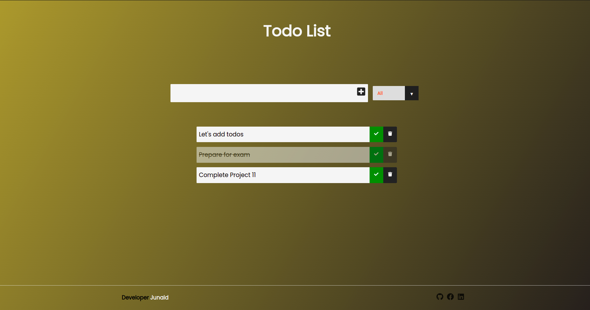
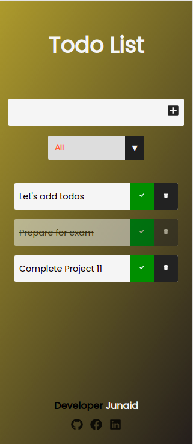

# :closed_book: Todo List App (ReacJS)

### _Todo List Applciation, built using CDD, ReactJs, Typescript, Storybook. Where Users can add, delete, filter todos !!_

### Demo Video :link: https://youtu.be/9t5IYmQdaVQ

### Link :link: https://todo-taskbox.web.app/

## Interface

## Mobile Interface

## Run Locally

- Run this command `git clone https://github.com/developer-junaid/React-Todo-List.git`
- You are now in the dev environment and you can play around

## Features
- Add Todos
- Delete Todos
- Filter Todos
- Accessibility Optimized
- Mobile Responsive
- Open Source (Tweak it and use it) :)

## Tech Stack

- HTML5
- CSS3
- ReactJs
- Typescript
- CDD (Component Driven Development)
- StoryBook (For Documentation)
